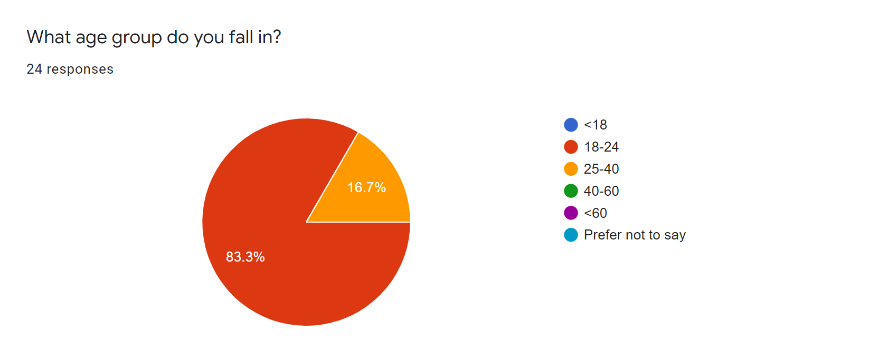
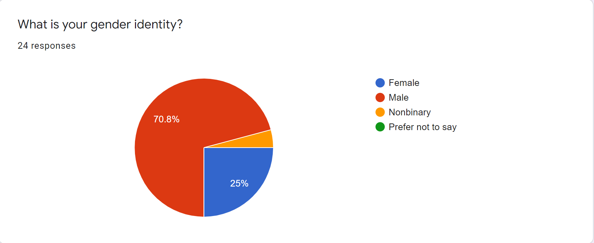
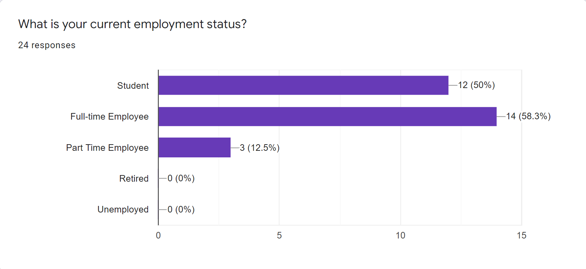

 <div id="myCarousel" class="carousel slide" data-ride="carousel">
  <!-- Indicators -->
  <ol class="carousel-indicators">
    <li data-target="#myCarousel" data-slide-to="0" class="active"></li>
    <li data-target="#myCarousel" data-slide-to="1"></li>
    <li data-target="#myCarousel" data-slide-to="2"></li>
  </ol>

  <!-- Wrapper for slides -->
  <div class="carousel-inner">
    <div class="item active">
      
    </div>
    <div class="item">
      
    </div>
    <div class="item">
      
    </div>
  </div>

  <!-- Left and right controls -->
  <a class="left carousel-control" href="#myCarousel" data-slide="prev">
    <span class="glyphicon glyphicon-chevron-left"></span>
    <span class="sr-only">Previous</span>
  </a>
  <a class="right carousel-control" href="#myCarousel" data-slide="next">
    <span class="glyphicon glyphicon-chevron-right"></span>
    <span class="sr-only">Next</span>
  </a>
</div>


<h2 id= "understanding"> Understanding the problem</h2>

<h2 id= "research"> Research</h2>

<h2 id= "dataAnalysis"> Data Analysis</h2>

<h2 id= "personas"> User Personas</h2>

### Markdown

Markdown is a lightweight and easy-to-use syntax for styling your writing. It includes conventions for

```markdown
Syntax highlighted code block

# Header 1

## Header 2

### Header 3

- Bulleted
- List

1. Numbered
2. List

**Bold** and _Italic_ and `Code` text

[Link](url) and 
```

For more details see [GitHub Flavored Markdown](https://guides.github.com/features/mastering-markdown/).

### Jekyll Themes

Your Pages site will use the layout and styles from the Jekyll theme you have selected in your [repository settings](https://github.com/KarinKazarian/SOEN357/settings). The name of this theme is saved in the Jekyll `_config.yml` configuration file.

### Support or Contact

Having trouble with Pages? Check out our [documentation](https://docs.github.com/categories/github-pages-basics/) or [contact support](https://support.github.com/contact) and we’ll help you sort it out.
