<div class="container">
  <h2>Dynamic Tabs with jQuery</h2>
  <p>Click on the Tabs to display the active and previous tab.</p>
  <ul class="nav nav-tabs">
    <li class="active"><a href="#home">Home</a></li>
    <li><a href="#menu1">Menu 1</a></li>
    <li><a href="#menu2">Menu 2</a></li>
    <li><a href="#menu3">Menu 3</a></li>
  </ul>

  <div class="tab-content">
    <div id="home" class="tab-pane fade in active">
      <h3>HOME</h3>
      <p>Lorem ipsum dolor sit amet, consectetur adipisicing elit, sed do eiusmod tempor incididunt ut labore et dolore magna aliqua.</p>
    </div>
    <div id="menu1" class="tab-pane fade">
      <h3>Menu 1</h3>
      <p>Ut enim ad minim veniam, quis nostrud exercitation ullamco laboris nisi ut aliquip ex ea commodo consequat.</p>
    </div>
    <div id="menu2" class="tab-pane fade">
      <h3>Menu 2</h3>
      <p>Sed ut perspiciatis unde omnis iste natus error sit voluptatem accusantium doloremque laudantium, totam rem aperiam.</p>
    </div>
    <div id="menu3" class="tab-pane fade">
      <h3>Menu 3</h3>
      <p>Eaque ipsa quae ab illo inventore veritatis et quasi architecto beatae vitae dicta sunt explicabo.</p>
    </div>
  </div>
    <hr>
    <p class="act"><b>Active Tab</b>: <span></span></p>
    <p class="prev"><b>Previous Tab</b>: <span></span></p>
</div>


<h2>Final Desgin</h2>


<h2 id= "understanding"> Understanding the problem</h2>

<h2 id= "research"> Research</h2>

<h2 id= "dataAnalysis"> Data Analysis</h2>

<h2 id= "personas"> User Personas</h2>

### Markdown

Markdown is a lightweight and easy-to-use syntax for styling your writing. It includes conventions for

```markdown
Syntax highlighted code block

# Header 1

## Header 2

### Header 3

- Bulleted
- List

1. Numbered
2. List

**Bold** and _Italic_ and `Code` text

[Link](url) and 
```

For more details see [GitHub Flavored Markdown](https://guides.github.com/features/mastering-markdown/).


<h3>Demographic Info</h3>
 <div id="myCarousel" class="carousel slide" data-ride="carousel">
  <!-- Indicators -->
  <ol class="carousel-indicators">
    <li data-target="#myCarousel" data-slide-to="0" class="active"></li>
    <li data-target="#myCarousel" data-slide-to="1"></li>
    <li data-target="#myCarousel" data-slide-to="2"></li>
  </ol>

  <!-- Wrapper for slides -->
  <div class="carousel-inner">
    <div class="item active">
      
    </div>
    <div class="item">
      
    </div>
    <div class="item">
      
    </div>
  </div>

  <!-- Left and right controls -->
  <a style="color:black;background:transparent;" class="left carousel-control" href="#myCarousel" data-slide="prev">
    <span class="glyphicon glyphicon-chevron-left"></span>
    <span class="sr-only">Previous</span>
  </a>
  <a style="color:black;background:transparent;" class="right carousel-control" href="#myCarousel" data-slide="next">
    <span class="glyphicon glyphicon-chevron-right"></span>
    <span class="sr-only">Next</span>
  </a>
</div>

 <h3>Super App</h3>
 <div id="superApp" class="carousel slide" data-ride="carousel">
  <!-- Indicators -->
  <ol class="carousel-indicators">
    <li data-target="#superApp" data-slide-to="0" class="active"></li>
    <li data-target="#superApp" data-slide-to="1"></li>
    <li data-target="#superApp" data-slide-to="2"></li>
    <li data-target="#superApp" data-slide-to="3" class="active"></li>
    <li data-target="#superApp" data-slide-to="4"></li>
    <li data-target="#superApp" data-slide-to="5"></li>
    <li data-target="#superApp" data-slide-to="6" class="active"></li>
    <li data-target="#superApp" data-slide-to="7"></li>
    <li data-target="#superApp" data-slide-to="8"></li>
    <li data-target="#superApp" data-slide-to="9" class="active"></li>
    <li data-target="#superApp" data-slide-to="10"></li>
    <li data-target="#superApp" data-slide-to="11"></li>
  </ol>

  <!-- Wrapper for slides -->
  <div class="carousel-inner">
    <div class="item active">
      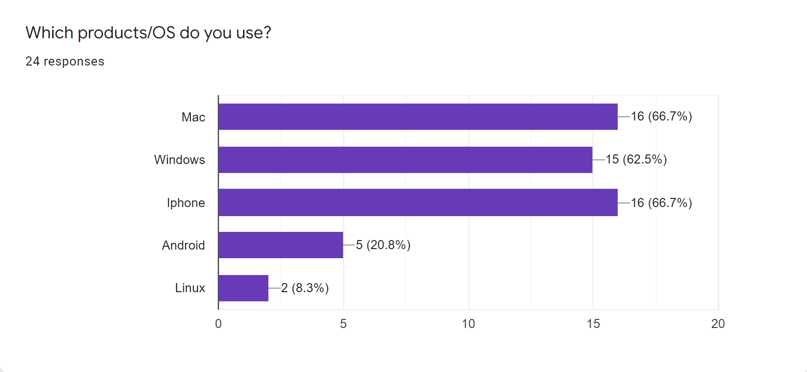
    </div>
    <div class="item">
      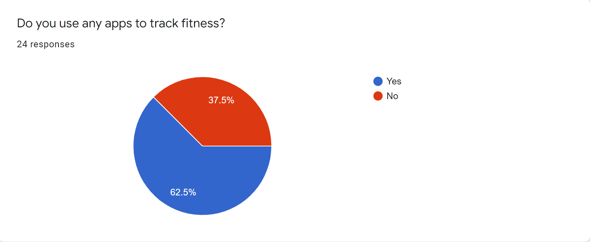
    </div>
    <div class="item">
      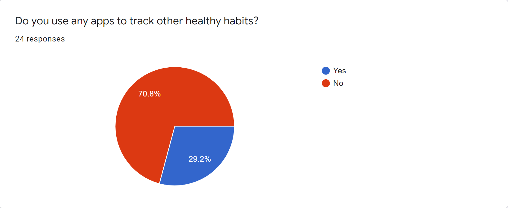
    </div>
    <div class="item">
      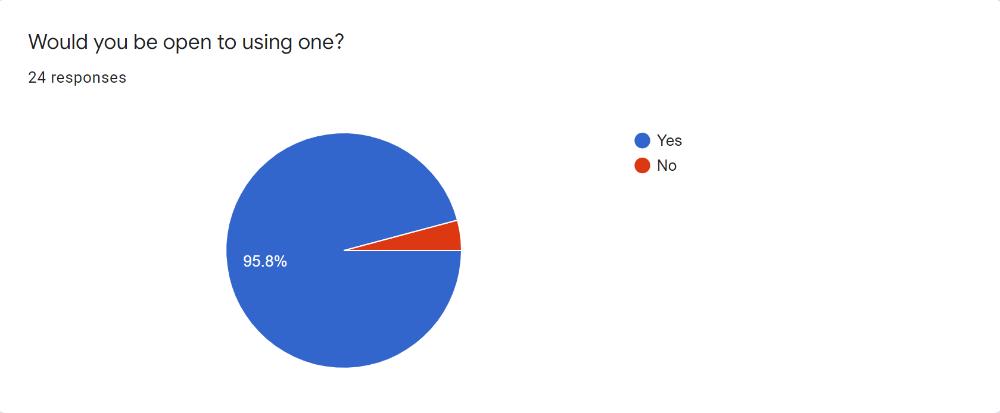
    </div>
    <div class="item">
      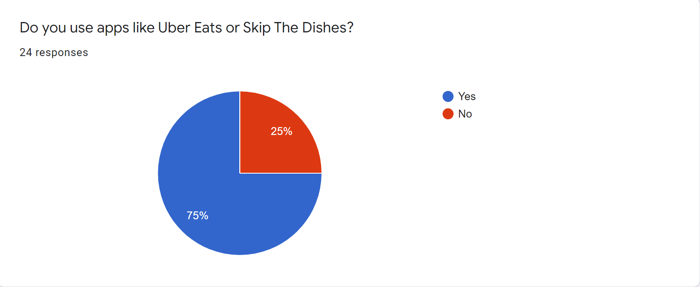
    </div>
    <div class="item">
      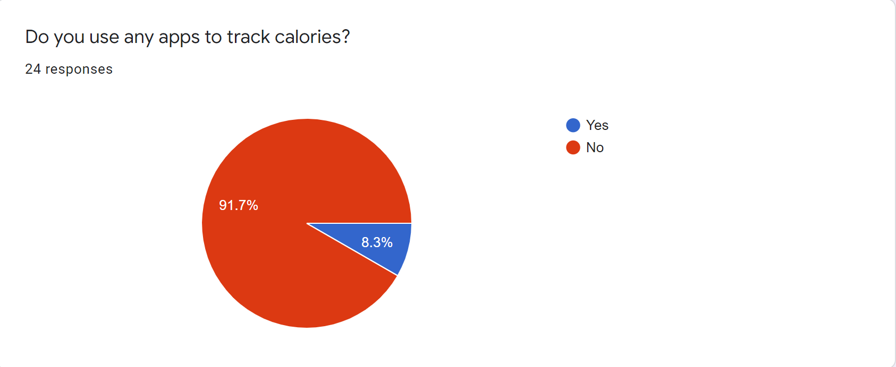
    </div>
    <div class="item">
      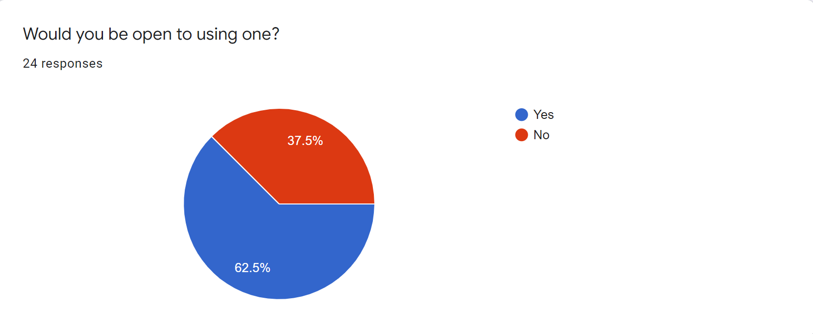
    </div>
    <div class="item">
      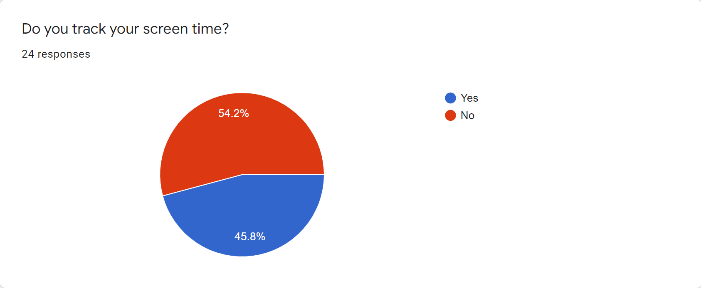
    </div>
    <div class="item">
      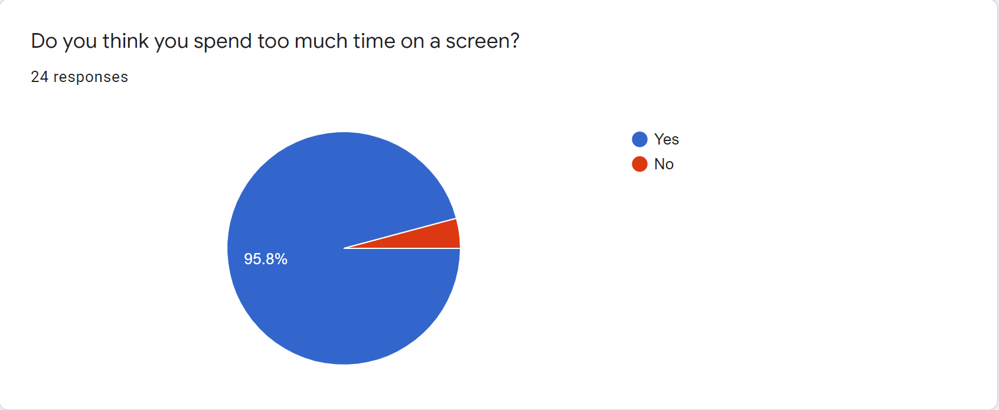
    </div>
    <div class="item">
      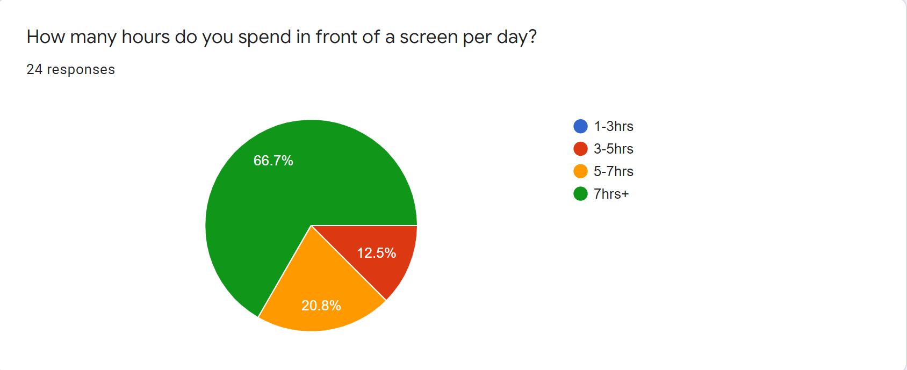
    </div>
    <div class="item">
      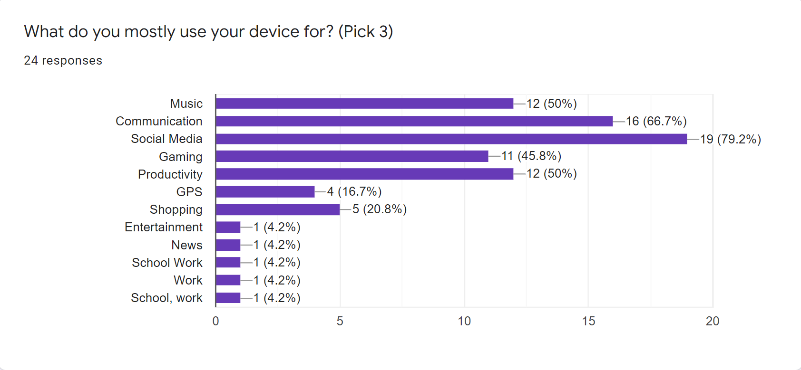
    </div>
    <div class="item">
      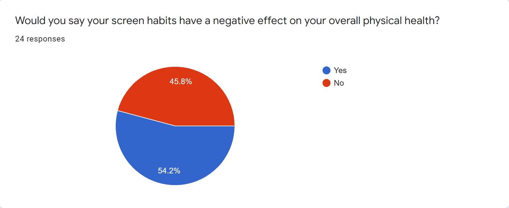
    </div> 
  </div>

  <!-- Left and right controls -->
  <a style="color:black;background:transparent;" class="left carousel-control" href="#superApp" data-slide="prev">
    <span class="glyphicon glyphicon-chevron-left"></span>
    <span class="sr-only">Previous</span>
  </a>
  <a style="color:black;background:transparent;" class="right carousel-control" href="#superApp" data-slide="next">
    <span class="glyphicon glyphicon-chevron-right"></span>
    <span class="sr-only">Next</span>
  </a>
</div>

<div id="superApp2" class="carousel slide" data-ride="carousel">
  <!-- Indicators -->
  <ol class="carousel-indicators">
    <li data-target="#superApp2" data-slide-to="0" class="active"></li>
    <li data-target="#superApp2" data-slide-to="1"></li>
    <li data-target="#superApp2" data-slide-to="2"></li>
   <li data-target="#superApp2" data-slide-to="3"></li>
   <li data-target="#superApp2" data-slide-to="4"></li>
   <li data-target="#superApp2" data-slide-to="5"></li>
   <li data-target="#superApp2" data-slide-to="6"></li>
  </ol>

  <!-- Wrapper for slides -->
  <div class="carousel-inner">
    <div class="item active">
      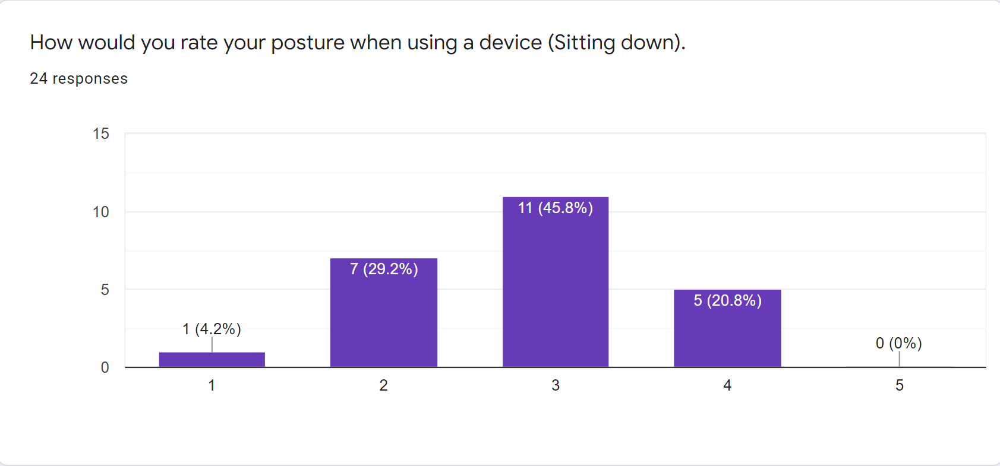
    </div>
    <div class="item">
      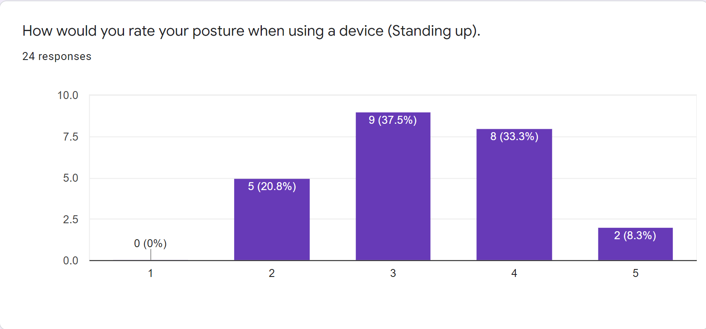
    </div>
    <div class="item">
      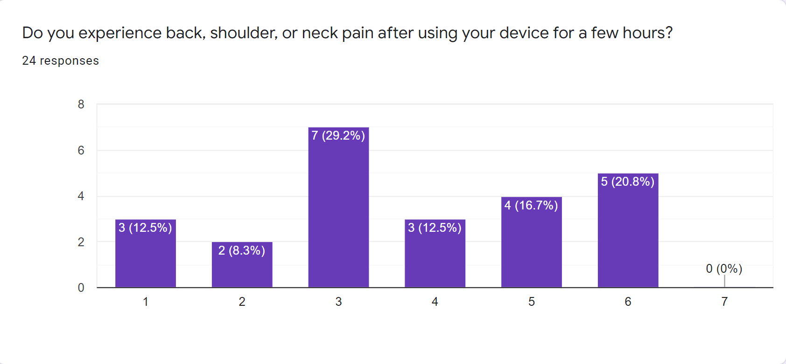
    </div>
    <div class="item">
      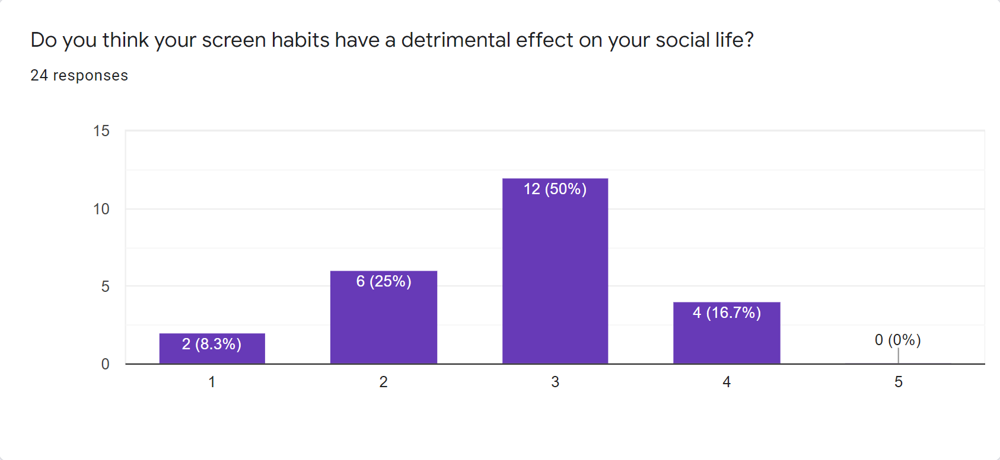
    </div>
    <div class="item">
      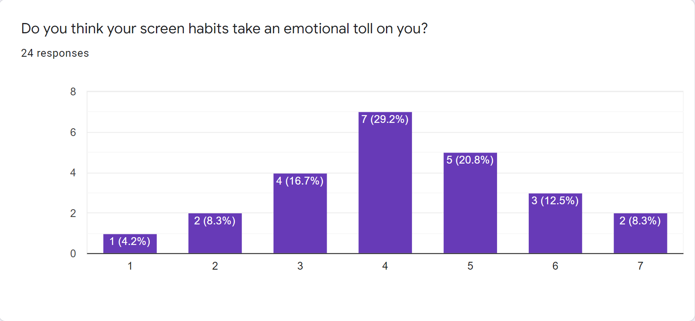
    </div>
    <div class="item">
      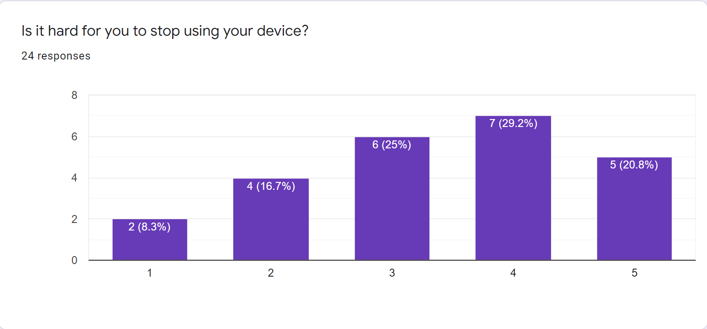
    </div>
    <div class="item">
      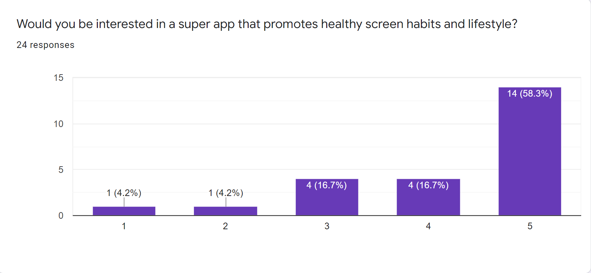
 </div>
  </div>

  <!-- Left and right controls -->
  <a style="color:black;background:transparent;" class="left carousel-control" href="#superApp2" data-slide="prev">
    <span class="glyphicon glyphicon-chevron-left"></span>
    <span class="sr-only">Previous</span>
  </a>
  <a style="color:black;background:transparent;" class="right carousel-control" href="#superApp2" data-slide="next">
    <span class="glyphicon glyphicon-chevron-right"></span>
    <span class="sr-only">Next</span>
  </a>
</div>

### Jekyll Themes

Your Pages site will use the layout and styles from the Jekyll theme you have selected in your [repository settings](https://github.com/KarinKazarian/SOEN357/settings). The name of this theme is saved in the Jekyll `_config.yml` configuration file.

### Support or Contact

Having trouble with Pages? Check out our [documentation](https://docs.github.com/categories/github-pages-basics/) or [contact support](https://support.github.com/contact) and we’ll help you sort it out.
